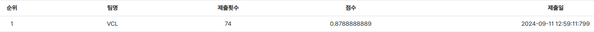
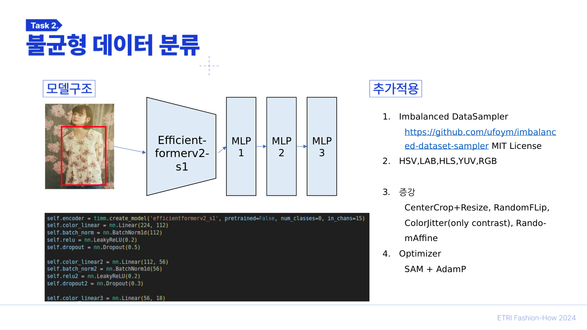

# Task2 - VCL팀

### Result
- 학습 성능
    - 11 epochs model
    - Train loss : 1.4363
    - Learning rate : 0.00005870(CosineAnnealingLR 적용)
    - Valid loss : 1.4585
    - ACSA : 0.64833

- 제출 성능
    

---

### Summary


---
#### 1. 필요 라이브러리 정보

아래의 커맨드를 통해 `requirements.txt` 파일을 생성하였습니다.

```bash
pip list --format=freeze > requirements.txt
```

추가적으로 사용한 라이브러리 정보는 다음과 같습니다.

- [torchsampler](https://pypi.org/project/torchsampler/) : `ImbalancedDatasetSampler` 샘플러를 사용하기 위함. (train.py)
- [adamp](https://pypi.org/project/adamp/) : `Adamp` 옵티마이저를 사용하기 위함. (train.py)

___
#### 2. 사용 코드

- [timm](https://github.com/huggingface/pytorch-image-models/tree/main/timm) : [`efficientformerv2_s1`](https://arxiv.org/abs/2212.08059) 모델을 사용하기 위함. (pretrained X) (networks.py) 
- [sam.py](https://github.com/davda54/sam) : `SAM Optimizer` 를 사용하기 위함. (train.py)

---
#### 3. 모델 학습 환경

- Ubuntu 18.04
- Python 3.10.0
- CUDA 11.8
- NVIDIA RTX 3090 GPU 1개

> timm 라이브러리와 관련하여 python 3.8, pytorch 1.12.1-cu113 의 환경에서 재현에 문제가 발생합니다.

---
#### 4. 모델 학습
- 데이터셋 준비
    - 대회에서 제공 받은 `Dataset` 폴더를 리눅스의 `ln -s` 명령어를 통해 현재의 위치에 링크하여 사용하였습니다.

- 학습
    - train.sh 파일을 사용하여 학습을 시작합니다.

        ```bash
        python train.py \
            --version 'exp1' \
            --epochs 70 \
            --optimizer SAM \
            --lr 2e-3 \
            --batch-size 64 \
            --seed 214
        ```
        --version : log, model 파일을 저장할 폴더이름 입니다.  
        학습을 시작하면 `exp1` 폴더가 logs, model 폴더안에 생성되며 학습이 시작됩니다.  

    - logs/exp1 폴더 안에 `exp1_training.log` 로그 파일이 생성되어 학습 로그를 기록합니다.

    - model/exp1 폴더 안에 모델이 Epoch 별로 저장됩니다.

- 모델 선택
    - log를 확인하여 valid loss, train loss, valid ACSA 순으로 우선순위를 두어 모델을 선택하였습니다.
        > 예를들어 logs/exp1.log 파일의 11 Epoch 에서의 모델을 선택하였습니다.

- 재현성 (참고)
    - model, logs 에 reproduce라는 이름의 버전으로 저희수준에서 재현한 결과를 만들었습니다.
    - logs/reproduce_training.log 를 logs/exp1_training.log 와 비교하여 모든 Epoch 재현이 가능함을 확인할 수 있습니다.
___